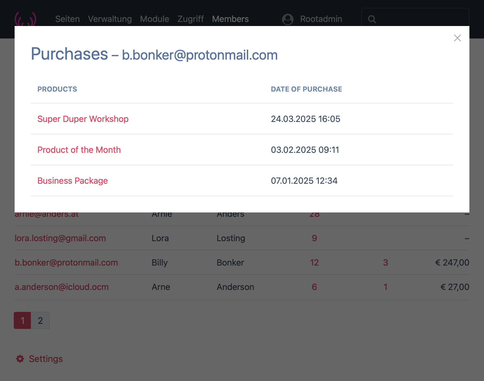

# ProcessUserDataTable Module

Licensed under GNU/GPL v2, see LICENSE.TXT  
Author: frameless Media · https://frameless.at  

The **ProcessUserDataTable** module provides a highly configurable table of user-related data in the ProcessWire admin interface. It allows administrators to define how fields are displayed, apply advanced formatting, resolve Page references, handle virtual fields, and add tooltips, all through a unified configuration structure.


Example of a configured UserAdminTable, also see [Examples Section](#examples)

---

## Table of Contents

1. [Overview](#overview)
2. [Installation](#installation)
3. [Configuration](#configuration)
4. [Field Configuration Syntax](#field-configuration-syntax)
5. [Configuration Parameters](#configuration-parameters)
6. [Formatting Options](#formatting-options)
7. [Examples](#examples)
8. [FAQ](#faq)

---

## Overview

The **ProcessUserDataTable** module provides advanced data table functionality for user data, including:

* Configurable data columns based on User template fields.
* Virtual fields with aggregation, formatting, and mapping capabilities.
* Tooltip content derived from field values, with configurable formatting.
* Centralized formatting through `formatValue()` method.
* Support for Page and PageArray fields with field resolution.
* Currency formatting with locale support, e.g., `currency(EUR:de_AT)`.

---

## Installation

1. **Download the Module**:

   * Clone the repository:
   `git clone https://github.com/frameless-at/ProcessUserDataTable.git`
   * Or download and extract the ZIP into your `/site/modules/` directory.

2. **Install via Admin**:

   * Navigate to `Modules > Site > Add New` and locate **ProcessUserDataTable**.

3. **Configuration**:

   * Step 1: Choose fields to display and define global settings. SAVE.
   * Step 2: Configure each of the chosen fields via Parameters. SAVE.

---

## Configuration

Configuration is divided into:

1. **Global Settings:** Define global sorting, filtering, and pagination options.
2. **Field Parameters:** Apply individual field configurations, including formatting, tooltips, and custom mappings.

---

## Field Configuration Syntax

Field configurations follow a strict key-value format, using the syntax:

```
key=value
key=option1|option2
```

---

## Configuration Parameters

The following configuration parameters are available:

| **Parameter**    | **Fieldtype(s)**      | **Mandatory** | **Options**                    |
| ---------------- | --------------------- | ------------- | ------------------------------ |
| `label`          | All                   | No            | String                         |
| `textAlign`      | All                   | No            | left, center, right            |
| `separator`      | All                   | No            | String                         |
| `format`         | All                   | No            | See Formatting Options         |
| `tooltip_field`  | All                   | No            | Fieldname                      |
| `tooltip_prefix` | All                   | No            | String                         |
| `tooltip_format` | All                   | No            | See Formatting Options         |
| `edit_link`      | Primitive             | No            | Bool (1, 0)                    |
| `table_column`   | TableField            | Yes           | Column name                    |
| `modal`          | TableField            | No            | Bool (1, 0)                    |
| `modal_skip`     | TableField            | No            | Column names, comma separated  |
| `modal_sort`     | TableField            | No            | Column name                    |
| `modal_sortdir`  | TableField            | No            | asc, desc                      |
| `resolve_page`   | TableField, PageField | No            | Fieldname                      |
| `as_link`        | TableField, PageField | No            | Bool (1, 0)                    |
| `selector`       | Virtual               | Yes           | See Selector Options           |

---

### Modal Configuration for TableFields

The module now supports modal displays for `FieldtypeTable` fields. This feature allows you to display data from a table field in a modal window with sorting, resolved page links, and custom labels.

### Example 

Assuming the following data in the `products` table field:

| ID  | product_id | product_session_id  | product_date |
|-----|------------|---------------------|--------------|
| 1   | 101        | abc123s987ah5532fwf | 1694646000   |
| 2   | 102        | def45as2v3fwrrddsd6 | 1694647200   |
| 3   | 103        | ghi7dss2xcf4gc4rnkm | 1694648400   |

The modal output with the configuration below will look like this:

| PRODUCT                         | PURCHASEDATE       |
|---------------------------------|--------------------|
| [Product A](https://example.com/product-101) | 13.05.2025 12:00 |
| [Product B](https://example.com/product-102) | 13.05.2025 12:20 |
| [Product C](https://example.com/product-103) | 13.05.2025 12:40 |

```
label: User Products
modal: 1
modal_sort: product_date
modal_sortdir: desc
table_column: product_id
resolve_page: title
modal_skip: product_session_id
```

- The `product_session_id` column is **skipped** as configured by the `modal_skip` parameter.
- The `product_id` column is **resolved as a page link**, using the `title` field.
- The `product_date` column is **formatted as a timestamp** in `d.m.Y H:i` format.

---

### Implementation Details

- **Modal Link and Modal ID:**  
  The modal is generated with a unique ID to prevent conflicts. The link displays the entry count and opens the modal.

- **Column Labels Handling:**  
  The column labels are fetched directly from the `FieldtypeTable` configuration using the `maxCols` setting. The structure is dynamically adapted to handle any number of columns.

- **Column Skipping Logic:**  
  The `modal_skip` parameter is processed as a comma-separated list of column names.  
  Columns listed in `modal_skip` will **not be rendered** in both the table headers and content.

- **Sorting Logic:**  
  Sorting is applied using the `modal_sort` and `modal_sortdir` parameters. The sorting is applied before generating the table content, ensuring that the data is rendered in the correct order.

- **Resolved Page Links:**  
  When `resolve_page` is configured, the specified column will be treated as a page reference, and its value will be rendered as a clickable link using the `resolve_page` field.

- **Error Handling:**  
  If the `resolve_page` column points to a non-existent page, the output will display `"Unknown"` instead of generating a broken link.

---

## Formatting Options

Formatting parameters can be applied to field values and tooltips. The available formats are as follows:

| **Format**              | **Description**                         | **Example**                                           |
| ----------------------- | --------------------------------------- | ----------------------------------------------------- |
| `int`                   | Rounds to nearest integer               | `123.45` → `123`                                      |
| `number`                | Formats as a number with 2 decimals     | `1234.56` → `1.234,56`                                |
| `currency(CODE:LOCALE)` | Currency formatting with locale support | `1234.56` → `currency(EUR:de_AT)` → `€ 1.234,56`      |
| `date(FORMAT)`          | Date formatting                         | `1652875200` → `date(d.m.Y H:i)` → `18.05.2023 12:00` |
| `map(KEY:VALUE,...)`    | Value mapping for specific values       | `map(0:Inactive,1:Active)`                            |
| `custom(SPRINTF)`       | Custom `sprintf()` format               | `custom(%0.2f kg)` → `123,46 kg`                      |

---

## Selector Options

The `selector` parameter is used primarily in virtual fields to perform calculations or data manipulations. The following selector options are available:

| **Selector Option**    | **Description**                 | **Example**                  |
| ---------------------- | ------------------------------- | -----------------------------|
| `sum(...)`             | Sums the values of a field      | `sum(orders.total)`          |
| `avg(...)`             | Averages the values of a field  | `avg(products.price)`        |
| `min(...)`             | Returns the minimum value       | `min(scores.value)`          |
| `max(...)`             | Returns the maximum value       | `max(sales.amount)`          |
| `count(...)`           | Counts the number of items      | `count(products.product_id)` |
| `join(..., SEPARATOR)` | Joins values with a separator   | `join(tags.name, ', ')`      |
| `FIELDNAME`            | Accesses a specific field value | `status`, `email`            |

### Selector Parameter Syntax

The `selector` parameter defines the data extraction logic for virtual fields and supports various functions. The syntax follows one of two structures:

#### **1. Two-Segment Path (Page Fields)**

For Page or PageArray fields, the syntax follows the format:
```
selector=FIELDNAME.SUBFIELD
```
- `FIELDNAME` – The field referencing Page(s).
- `SUBFIELD` – The property or field to extract.

**Examples:**
- `selector=count(roles.id)` – Counts the number of roles assigned to the user.
- `selector=join(languages.title, ', ')` – Joins the titles of the user’s languages.

---

#### **2. Three-Segment Path (Table Fields)**

For FieldtypeTable fields, the syntax follows the format:
```
selector=TABLEFIELD.IDFIELD.VALUEFIELD
```
- `TABLEFIELD` – The FieldtypeTable field in the user template.
- `IDFIELD` – The column in the table that references a Page ID.
- `VALUEFIELD` – The field in the referenced Page from which the data is extracted.

**Examples:**
- `selector=sum(products.product_id.price)` – Sums the `price` of all products a user has purchased.
- `selector=count(products.product_id)` – Counts the number of products.
- `selector=join(products.product_id.title, ', ')` – Joins the product titles.

---

### **Why the 3-Segment Structure?**

- The 3-segment structure is necessary to maintain the link between a **table row and its referenced Page object**.
- It allows for accessing Page properties (`price`, `title`) based on a reference field (`product_id`).

---

### **Summary:**
- **2-segment structure** is for direct Page or PageArray fields.
- **3-segment structure** is for complex data relationships in FieldtypeTable fields, maintaining links between rows and referenced Pages.

---


## Examples

### Visual Example

**UserAdminTable with users that have the 'member' status (showing their created value on :hover), their visits of certain pages (with modal opening for details), their purchases (with modal opening for details) and the Total of their purchases.**
All column titles are clickable for sorting asc/desc, direction is indicated after sorting


:hover over the email adress to show the users created value, click on it and you get to the users edit page


Click on the pages/view value of a user and the details show in a modal. The pages shown are linked.


Click on the purchases value of a user and the details show in a modal. The pages shown are linked.




**Configuration of this table – Step 1: Choose Fields and global settings**
The user fields are pulled from the User template. Virtual fields have to start with `virtual__` and are comma separated. Default sorting field: All user related fields or properties (like `created`).


**Configuration of this table – Step 2: After saving the above Settings Configuration fields with default values for each chosen or defined virtual field will be displayed below. Configuration options for each field (depending on fieldtype) will be shown beneath as notes**


### Configuration Examples

**1. Displaying a TableField of purchases, linked to the product page, with Tooltips that show the date of the purchase:**

```
label=Products Bought
table_column=product_id
resolve_page=title
as_link=1
tooltip_field=purchase_date
tooltip_prefix=Purchased:
tooltip_format=date(d.m.Y H:i)
```

**2. Virtual Field for showing the Sum of all products purchased per user:**

```
selector=sum(products.product_id.price)
label=Total Sales
format=currency(EUR:de_AT)
```

**3. Checkbox Field with Custom Labels:**

```
label=Status
format=map(0:Inactive,1:Active)
```

---

## FAQ

* **How do I format tooltip values?**

  * Tooltip values now use the same `format` syntax as field values, processed through the `formatValue()` method.
---

* **Can I use multiple mappings?**

  * Yes. Use the `map()` syntax for clear key-value mappings.
---

* **How do I resolve Page references?**

  * Use the `resolve_page` parameter to specify a subfield of the referenced Page.
---

* **What happens if a format is not recognized?**

  * The value will be returned as-is, without formatting.
---

* **Can I customize currency symbols?**

  * Yes, the `currency()` format allows full locale support, e.g., `currency(EUR:de_AT)`.
